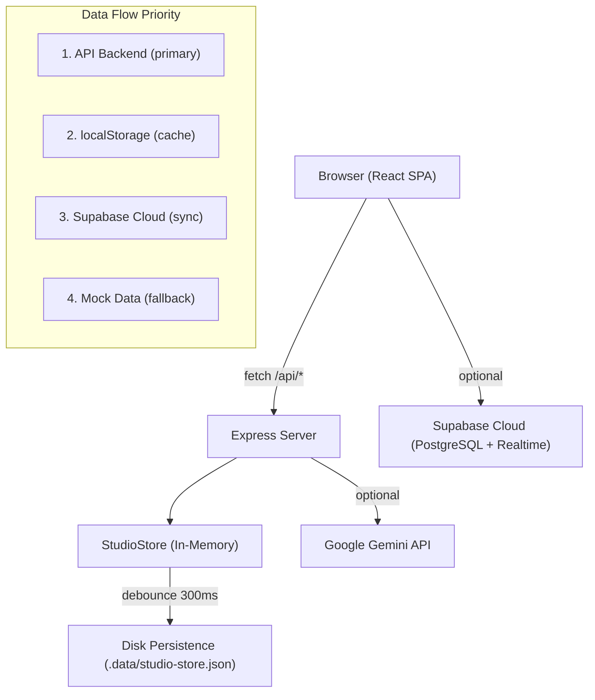
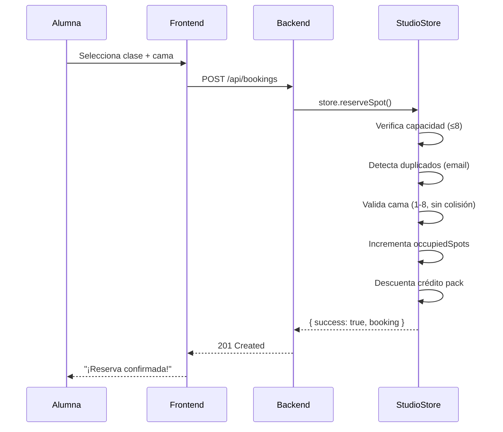

# 📋 FIRME STUDIO — Documento de Handoff Completo

> **Proyecto:** FIRME STUDIO — Pilates Reformer & Boutique  
> **Propietario:** Valentino (Owner/Lead Developer)  
> **Ubicación:** Jr. Akapana 1261, San Juan de Lurigancho (Lima - SJL), Perú  
> **Equipamiento:** 8 Camas Reformer Allegro 2 (Balanced Body)  
> **Fecha:** Septiembre 2026  

---

## 1. Visión General del Proyecto

FIRME STUDIO es una **plataforma integral de gestión** para un estudio boutique de Pilates Reformer. Maneja toda la operación del estudio: reservas de clases, gestión de alumnas, finanzas (caja POS), automatización WhatsApp, embudo de captación de leads, gamificación EXP, check-in por QR/kiosco y asistente IA biomecánico.

### Usuarios del Sistema

| Rol | Acceso | Ejemplo |
|---|---|---|
| **Owner Dev** | Acceso total: infraestructura, APIs, backend, Supabase, alternancia de perfiles | Valentino |
| **Admin** | Panel admin: agenda, CRM, caja, WhatsApp, reportes | Soni, Keyla |
| **Recepcionista** | Check-in, cobros rápidos (Yape/POS/Efectivo), alta de clientas | Personal recepción |
| **Instructora** | Vista en sala: mapa 8 camas, alertas médicas/posturales | Valeria, Mateo |
| **Alumna (Client)** | Reservas, horarios, FIRME PASS QR, nivel EXP, boutique | Alumnas registradas |

---

## 2. Stack Tecnológico

### Frontend
| Tecnología | Versión | Uso |
|---|---|---|
| React | 19.3.0 | UI framework (SPA) |
| TypeScript | ~5.8.2 | Tipado estático |
| Vite | 6.2.3 | Build tool + HMR dev server |
| Tailwind CSS | 4.1.14 | Styling utility-first |
| Motion (Framer) | 12.23.24 | Animaciones |
| Recharts | 3.10.1 | Gráficos y reportes |
| Lucide React | 0.546.0 | Iconografía |
| @supabase/supabase-js | 2.116.0 | Cliente Supabase (auth + realtime) |

### Backend
| Tecnología | Versión | Uso |
|---|---|---|
| Node.js | ES2022+ | Runtime |
| Express | 4.21.2 | HTTP framework |
| TypeScript | ~5.8.2 | Tipado |
| tsx | 4.21.0 | TS runner para desarrollo |
| esbuild | 0.25.0 | Bundler para producción |
| compression | 1.8.2 | Gzip para respuestas |
| dotenv | 17.2.3 | Variables de entorno |
| @google/genai | 2.4.0 | Gemini AI (análisis + chat + biomecánica) |

### Base de Datos
| Componente | Descripción |
|---|---|
| **In-memory Store** | `StudioStore` singleton con datos en RAM |
| **Disk Persistence** | Snapshots atómicos a `.data/studio-store.json` (debounce 300ms) |
| **Supabase Cloud** | PostgreSQL + Realtime (opcional, con fallback local) |

---

## 3. Estructura de Directorios

```
d:\estudio-reforma\
├── .data/                          # Snapshots de persistencia (gitignored)
├── .env                            # Variables de entorno (gitignored)
├── .env.example                    # Plantilla de variables de entorno
├── .gitignore
├── README.md
├── index.html                      # Entry HTML (SPA)
├── metadata.json                   # Metadata del proyecto
├── package.json                    # Dependencias y scripts
├── package-lock.json
├── tsconfig.json                   # Configuración TypeScript
├── vite.config.ts                  # Configuración Vite + Tailwind + code splitting
├── vercel.json                     # Config deployment Vercel (SPA rewrite)
├── server.ts                       # 🔑 Entry point del backend Express
├── supabase_schema_v2.sql          # Schema SQL completo para Supabase
│
├── docs/                           # Documentación técnica
│   ├── README.md
│   ├── 01_ARQUITECTURA_GENERAL.md
│   ├── 02_AUTENTICACION_Y_ROLES.md
│   ├── 03_RESERVAS_Y_SALA.md
│   ├── 04_TOTEM_RECEPCION_SJL.md
│   ├── 05_PANEL_ADMINISTRATIVO.md
│   ├── 06_FINANZAS_Y_BOUTIQUE.md
│   ├── 07_BASE_DE_DATOS_SUPABASE.md
│   └── 08_BACKEND_Y_APIS.md
│
├── server/                         # 🔑 Backend (Express + TypeScript)
│   ├── data/
│   │   ├── store.ts                # StudioStore — singleton con lógica de negocio
│   │   └── persistence.ts          # Persistencia atómica a disco
│   ├── middleware/
│   │   ├── asyncHandler.ts         # Wrapper async para Express 4
│   │   ├── errorHandler.ts         # Manejo centralizado de errores
│   │   ├── rateLimiter.ts          # Rate limiting sliding window
│   │   └── security.ts             # Headers HTTP de seguridad + CORS
│   ├── routes/
│   │   ├── ai.ts                   # Gemini AI (insights, biomecánica, chat)
│   │   ├── bookings.ts             # Reservas atómicas y check-in
│   │   ├── classes.ts              # CRUD de sesiones de clase
│   │   ├── clients.ts              # CRUD de clientas/alumnas
│   │   ├── finance.ts              # Caja POS, transacciones, gastos
│   │   ├── health.ts               # Health check + métricas
│   │   ├── leads.ts                # Embudo CRM + conversión a alumna
│   │   └── whatsapp.ts             # Templates y logs WhatsApp
│   └── tests/
│       └── api.test.ts             # 37 tests de integración
│
├── src/                            # 🔑 Frontend (React + TypeScript)
│   ├── App.tsx                     # Componente raíz (~1100 líneas)
│   ├── main.tsx                    # Entry point React
│   ├── index.css                   # Imports Tailwind CSS v4
│   ├── types.ts                    # 🔑 Tipos compartidos + RBAC + roles
│   ├── vite-env.d.ts               # Tipos de Vite
│   │
│   ├── components/                 # Componentes de UI
│   │   ├── AdminPanel.tsx          # Panel administrador wrapper
│   │   ├── AiAssistantWidget.tsx   # Widget chat IA flotante
│   │   ├── BiomechanicsQuizModal.tsx # Test biomecánico interactivo
│   │   ├── BookingModal.tsx        # Modal de reserva de clase
│   │   ├── BoutiqueSection.tsx     # Tienda + canje EXP
│   │   ├── ClientCheckInModal.tsx  # Modal check-in por DNI/QR
│   │   ├── EditProfileModal.tsx    # Edición de perfil de alumna
│   │   ├── FaqSection.tsx          # Preguntas frecuentes
│   │   ├── FinalCTA.tsx            # CTA final de la landing
│   │   ├── FloatingAdminButton.tsx # Botón flotante acceso admin
│   │   ├── Footer.tsx              # Footer del sitio
│   │   ├── GoogleAuthModal.tsx     # Login Google OAuth + registro manual
│   │   ├── Header.tsx              # Header/Navbar principal
│   │   ├── Hero.tsx                # Hero section landing
│   │   ├── InstructorGrid.tsx      # Grid de instructoras
│   │   ├── LegalModals.tsx         # Términos y privacidad
│   │   ├── LibroReclamacionesModal.tsx # Libro de reclamaciones (legal PE)
│   │   ├── LocationSection.tsx     # Sección mapa/ubicación
│   │   ├── MyClasses.tsx           # 🔑 Mis Clases + FIRME PASS (QR real)
│   │   ├── NewHereSection.tsx      # Sección "¿Eres nueva?"
│   │   ├── PlanCheckoutModal.tsx   # Checkout compra de plan
│   │   ├── PricingSection.tsx      # Planes y precios
│   │   ├── QuickRegistrationLanding.tsx # Registro rápido por QR
│   │   ├── ReceptionKioskModal.tsx # Tótem/kiosco de recepción
│   │   ├── ReceptionQrModal.tsx    # QR de recepción
│   │   ├── ScheduleCalendar.tsx    # Calendario semanal de clases
│   │   ├── StaffDestinationHub.tsx # Hub de navegación staff
│   │   ├── StudentLevelModal.tsx   # Modal sistema de niveles EXP
│   │   ├── StudentProgressTab.tsx  # Tab progreso + gamificación
│   │   ├── StudioToast.tsx         # Componente toast/notificaciones
│   │   ├── Testimonials.tsx        # Testimonios de alumnas
│   │   ├── WhatsAppFloat.tsx       # Botón WhatsApp flotante
│   │   │
│   │   └── admin/                  # Componentes del Panel Admin
│   │       ├── AdminAgendaTab.tsx       # Agenda semanal de clases
│   │       ├── AdminBackendTab.tsx      # Monitor backend/APIs
│   │       ├── AdminBannersTab.tsx      # Gestión de banners
│   │       ├── AdminCashTab.tsx         # Caja diaria POS
│   │       ├── AdminClientsTab.tsx      # CRM de alumnas
│   │       ├── AdminDashboardTab.tsx    # Dashboard ejecutivo
│   │       ├── AdminExpensesTab.tsx     # Control de gastos
│   │       ├── AdminGate.tsx            # Gate de acceso admin (PIN)
│   │       ├── AdminHeader.tsx          # Header panel admin
│   │       ├── AdminInstructorTab.tsx   # Modo instructora (sala)
│   │       ├── AdminKioskTab.tsx        # Tótem SJL check-in
│   │       ├── AdminLeadsTab.tsx        # Embudo de captación
│   │       ├── AdminReportsTab.tsx      # Reportes/analytics
│   │       ├── AdminSettingsTab.tsx     # Configuración del estudio
│   │       ├── AdminSidebar.tsx         # Sidebar navegación admin
│   │       ├── AdminUsersTab.tsx        # Gestión de usuarios/staff
│   │       ├── AdminWhatsAppTab.tsx     # Automatización WhatsApp
│   │       └── WeeklyOccupancyBarChart.tsx # Gráfico ocupación semanal
│   │
│   ├── data/                       # Datos mock/iniciales
│   │   ├── adminMockData.ts        # Clientes, transacciones, gastos, leads
│   │   ├── bannerData.ts           # Banners del carrusel
│   │   ├── mockData.ts             # Clases, instructoras, testimonios
│   │   └── studentProgressionData.ts # Sistema de niveles/EXP
│   │
│   ├── hooks/                      # Custom hooks React
│   │   ├── useStudioAuth.ts        # Auth: login, logout, roles, Google OAuth
│   │   ├── useStudioData.ts        # Data: CRUD, sync API+localStorage+Supabase
│   │   └── useToast.ts             # Sistema de notificaciones toast
│   │
│   ├── lib/
│   │   └── supabase.ts             # Cliente Supabase + detección de config
│   │
│   └── services/
│       ├── api.ts                  # 🔑 Cliente HTTP tipado (studioApi)
│       └── supabaseService.ts      # Capa Supabase: auth, CRUD, realtime
│
└── dist/                           # Build de producción (gitignored)
```

---

## 4. Variables de Entorno

Archivo `.env` (basado en [.env.example](file:///d:/estudio-reforma/.env.example)):

| Variable | Requerida | Descripción |
|---|---|---|
| `VITE_SUPABASE_URL` | Opcional | URL del proyecto Supabase (ej: `https://xxx.supabase.co`) |
| `VITE_SUPABASE_ANON_KEY` | Opcional | Clave pública anon de Supabase |
| `SUPABASE_SERVICE_ROLE_KEY` | Opcional | Clave de servicio (admin backend) |
| `GEMINI_API_KEY` | Opcional | API key de Google Gemini para IA |
| `PORT` | Opcional | Puerto del servidor (default: `3000`) |
| `NODE_ENV` | Opcional | `development` o `production` |
| `APP_ORIGIN` | Opcional | Origen permitido para CORS en producción |

> [!NOTE]
> El sistema funciona **sin Supabase y sin Gemini**. Usa datos mock + persistencia en disco + heurísticas locales como fallback completo.

---

## 5. Scripts del Proyecto

```bash
npm run dev        # Inicia servidor Express + Vite HMR (puerto 3000)
npm run build      # Build frontend (Vite) + backend (esbuild → dist/server.cjs)
npm run start      # Sirve producción: node dist/server.cjs
npm run preview    # Vite preview del build frontend
npm run lint       # TypeScript check sin emitir (tsc --noEmit)
npm run test       # Ejecuta 37 tests de integración (tsx server/tests/api.test.ts)
npm run clean      # Limpia dist/ y server.js
```

---

## 6. Arquitectura del Sistema

### 6.1 Flujo de Datos



### 6.2 Ciclo de Vida de una Request

1. **Browser** → `studioApi.method()` → `fetch('/api/...')`
2. **Express** → Security Headers → CORS → Compression → Body Parser → Rate Limiter
3. **Route Handler** → `asyncHandler()` → Validación → `store.method()`
4. **StudioStore** → Lógica atómica → `persistence.scheduleSave()` (debounce)
5. **Response** → `{ success: true/false, data: ..., message: '...' }`

### 6.3 Navegación Frontend

La app usa **hash-based routing** (`window.location.hash`):

| Hash | Vista | Acceso |
|---|---|---|
| `#inicio` | Landing page pública | Todos |
| `#horarios` | Calendario semanal de clases | Todos |
| `#mis-clases` | Mis reservas + FIRME PASS | Alumnas logueadas |
| `#niveles` | Sistema de niveles EXP | Alumnas logueadas |
| `#membresias` | Planes y precios | Todos |
| `#profesores` | Grid de instructoras | Todos |
| `#metodo` | Método Pilates Reformer | Todos |
| `#admin` | Panel administrador | Owner/Admin |
| `#staff-hub` | Hub de staff | Owner/Admin/Instructora |
| `#kiosco` | Tótem de recepción (auto check-in) | Recepción |
| `#instructor` | Modo instructora (sala) | Instructora |
| `#registro` | Registro rápido por QR | Público |

---

## 7. API REST — Referencia Completa

> **Base URL:** `http://localhost:3000/api`  
> **Formato:** Todas las respuestas siguen `{ success: boolean, data?: T, error?: string, message?: string }`

### 7.1 Health

| Método | Endpoint | Descripción |
|---|---|---|
| `GET` | `/api/health` | Estado del servidor, métricas, memoria, uptime |

---

### 7.2 Classes (Sesiones de Clase)

| Método | Endpoint | Descripción | Body |
|---|---|---|---|
| `GET` | `/api/classes` | Listar clases (filtro: `?day=`, `?instructor=`, `?level=`) | — |
| `GET` | `/api/classes/:id` | Obtener clase por ID | — |
| `POST` | `/api/classes` | Crear nueva sesión | `{ name, instructor, time, duration?, totalSpots?, day, level, classType, focus?, description? }` |
| `PUT` | `/api/classes/:id` | Actualizar sesión | `Partial<ClassSession>` |
| `DELETE` | `/api/classes/:id` | Eliminar sesión | — |

**Tipos clave:**
- `day`: `'lun'|'mar'|'mie'|'jue'|'vie'|'sab'|'dom'`
- `level`: `'Principiante'|'Intermedio'|'Avanzado'`
- `classType`: `'Reformer'|'Mat'|'Suspensión'`

---

### 7.3 Bookings (Reservas)

| Método | Endpoint | Descripción | Body |
|---|---|---|---|
| `GET` | `/api/bookings` | Listar reservas (filtro: `?classId=`, `?clientEmail=`, `?status=`) | — |
| `POST` | `/api/bookings` | **Reservar cupo** (atómico: capacidad + duplicados + cama) | `{ classId, clientName, clientEmail, clientPhone?, clientDni?, bedNumber?, medicalAlert? }` |
| `PATCH` | `/api/bookings/:id/status` | Cambiar estado | `{ status: 'confirmada'|'asistio'|'cancelada' }` |
| `POST` | `/api/bookings/:id/check-in` | Check-in en recepción/kiosco | `{ bedNumber? }` |
| `POST` | `/api/bookings/:id/assign-bed` | Asignar/cambiar cama Reformer (1-8) | `{ bedNumber }` |
| `POST` | `/api/bookings/:id/cancel-with-refund` | Cancelación justa con devolución de crédito | — |
| `DELETE` | `/api/bookings/:id` | Eliminar reserva | — |

**Lógica de negocio en `reserveSpot()`:**
1. Verifica capacidad (máx 8 camas por clase)
2. Previene reservas duplicadas por email en la misma sesión
3. Valida cama 1-8 y detecta colisiones
4. Incrementa `occupiedSpots` atómicamente
5. Descuenta 1 crédito del pack de la alumna (si aplica)

---

### 7.4 Clients (Alumnas)

| Método | Endpoint | Descripción | Body |
|---|---|---|---|
| `GET` | `/api/clients` | Listar (filtro: `?search=`, `?status=`, `?planType=`) | — |
| `GET` | `/api/clients/:id` | Obtener por ID | — |
| `POST` | `/api/clients` | Crear alumna (detecta duplicados DNI/email) | `{ name, dni, phone, email, currentPlan?, planType?, creditsLeft?, emergencyContact?, medicalNotes? }` |
| `PUT` | `/api/clients/:id` | Actualizar ficha | `Partial<ClientProfile>` |
| `DELETE` | `/api/clients/:id` | Eliminar alumna | — |

**Tipos de plan:** `'ilimitado'|'pack'|'clase_suelta'|'prueba'`  
**Estados:** `'activo'|'en_riesgo'|'inactivo'`

---

### 7.5 Finance (Finanzas)

| Método | Endpoint | Descripción |
|---|---|---|
| `GET` | `/api/finance/register` | Estado de la caja diaria |
| `POST` | `/api/finance/register/toggle` | Abrir/cerrar caja diaria |
| `GET` | `/api/finance/transactions` | Listar ingresos (filtro: `?paymentMethod=`, `?category=`, `?date=`) |
| `POST` | `/api/finance/transactions` | Registrar cobro (valida monto positivo + `Number.isFinite`) |
| `PUT` | `/api/finance/transactions/:id` | Actualizar transacción |
| `DELETE` | `/api/finance/transactions/:id` | Anular transacción |
| `GET` | `/api/finance/expenses` | Listar gastos operativos |
| `POST` | `/api/finance/expenses` | Registrar gasto |
| `PUT` | `/api/finance/expenses/:id` | Actualizar gasto |
| `DELETE` | `/api/finance/expenses/:id` | Eliminar gasto |

**Métodos de pago:** `'yape'|'plin'|'tarjeta_pos'|'efectivo'|'transferencia_bcp'|'transferencia_bbva'`  
**Moneda:** PEN (Soles peruanos — S/.)

---

### 7.6 Leads (Embudo CRM)

| Método | Endpoint | Descripción |
|---|---|---|
| `GET` | `/api/leads` | Listar (filtro: `?status=`, `?channel=`, `?interest=`) |
| `POST` | `/api/leads` | Crear prospecto |
| `PUT` | `/api/leads/:id` | Actualizar prospecto |
| `PATCH` | `/api/leads/:id/status` | Cambiar etapa del embudo |
| `POST` | `/api/leads/:id/convert` | **Convertir lead → alumna oficial** (crea ClientProfile) |
| `DELETE` | `/api/leads/:id` | Eliminar prospecto |

**Etapas del embudo:**  
`nuevo → contactado → prueba_agendada → asistio_prueba → convertido | no_interesado`

**Canales:** `'instagram'|'tiktok'|'whatsapp'|'web_organico'|'recomendacion'`

---

### 7.7 AI (Gemini)

| Método | Endpoint | Modelo | Descripción |
|---|---|---|---|
| `POST` | `/api/ai/studio-insights` | `gemini-3.8-flash` | Análisis operativo del estudio (métricas → recomendaciones) |
| `POST` | `/api/ai/biomechanics-advisor` | `gemini-3.8-flash` | Asesor biomecánico (condición → resortes, cabecero, contraindicaciones) |
| `POST` | `/api/ai/chat` | `gemini-2.5-flash` | Concierge virtual FIRME AI (chat con contexto del estudio) |

> [!IMPORTANT]
> Cada endpoint tiene un **fallback heurístico completo** que responde respuestas inteligentes predefinidas si la API Key no está configurada o si Gemini tiene un timeout (6 segundos). La app **nunca falla** por ausencia de IA.

---

### 7.8 WhatsApp

| Método | Endpoint | Descripción |
|---|---|---|
| `GET` | `/api/whatsapp/templates` | Templates de mensajes (recordatorio, lista espera, post-prueba, cancelación) |
| `GET` | `/api/whatsapp/logs` | Historial de mensajes enviados |
| `POST` | `/api/whatsapp/send-log` | Registrar envío de mensaje |

---

## 8. Seguridad

### 8.1 Headers HTTP ([security.ts](file:///d:/estudio-reforma/server/middleware/security.ts))

- `X-Content-Type-Options: nosniff` — Previene MIME sniffing
- `X-Frame-Options: SAMEORIGIN` — Previene clickjacking
- `X-XSS-Protection: 1; mode=block` — Filtro XSS en browsers legacy
- `Referrer-Policy: strict-origin-when-cross-origin` — Control de referrer
- `Permissions-Policy: camera=(), microphone=(), geolocation=()` — Restricción de APIs
- Eliminación de `X-Powered-By` — Reduce fingerprinting

### 8.2 Rate Limiting ([rateLimiter.ts](file:///d:/estudio-reforma/server/middleware/rateLimiter.ts))

Sliding window in-memory con limpieza automática cada 5 minutos:

| Scope | Límite | Ventana |
|---|---|---|
| Global API | 200 req | 1 min |
| Bookings | 40 req | 1 min |
| AI/Gemini | 20 req | 1 min |
| WhatsApp | 30 req | 1 min |

### 8.3 CORS

- **Desarrollo:** Acepta `localhost:3000`, `localhost:5173`, `127.0.0.1:*`
- **Producción:** Solo orígenes en allowlist + `APP_ORIGIN` env

### 8.4 Validación de Entrada

- Todos los body params son validados y sanitizados (`.trim()`, `.slice()` para longitud)
- Camas validadas con `Number.isInteger()` + rango `[1, 8]`
- Montos financieros validados con `Number.isFinite()` + `> 0`
- Inputs de IA limitados a 300-500 caracteres

---

## 9. Persistencia y Flujo de Datos

### 9.1 In-Memory Store ([store.ts](file:///d:/estudio-reforma/server/data/store.ts))

El `StudioStore` es un **singleton** que mantiene toda la data en RAM:

```
StudioStore
├── classes: ClassSession[]          # Sesiones de clase semanales
├── bookings: BookingRecord[]        # Reservas de alumnas
├── clients: ClientProfile[]         # Fichas de alumnas
├── transactions: CashTransaction[]  # Ingresos/cobros
├── expenses: ExpenseRecord[]        # Gastos operativos
├── leads: LeadRecord[]              # Prospectos CRM
├── cashRegister: CashRegisterState  # Estado caja diaria
└── whatsappLogs: WhatsAppMessageLog[] # Historial WhatsApp
```

### 9.2 Disk Persistence ([persistence.ts](file:///d:/estudio-reforma/server/data/persistence.ts))

- **Ubicación:** `.data/studio-store.json`
- **Escritura atómica:** Escribe a `.tmp` y luego `rename()` (previene corrupción)
- **Debounce:** 300ms para evitar exceso de I/O en mutaciones rápidas
- **Startup:** Si existe snapshot en disco, restaura en constructor del store
- **Shutdown:** `SIGINT`/`SIGTERM` ejecutan `saveImmediate()` antes de cerrar

### 9.3 Frontend Data Layer

```
useStudioData hook
├── State: useState con inicialización desde localStorage
├── Mount: Intenta cargar datos desde API backend
├── Fallback: Si falla, usa datos de localStorage
├── Sync: Si Supabase está configurado, sincroniza con cloud
└── Persist: Cada mutación guarda en localStorage + API + Supabase (si hay)
```

---

## 10. Sistema de Roles (RBAC)

Definido en [types.ts](file:///d:/estudio-reforma/src/types.ts) con `ROLE_DEFINITIONS`:

```typescript
type UserRole = 'owner_dev' | 'admin' | 'receptionist' | 'instructor' | 'client';
```

### Determinación automática de rol

La función `determineUserRole(name, email, dni)` detecta automáticamente:

- **Owner Dev:** DNI `70112233`, email `tino@firme.com` o `tinoykz@gmail.com`, nombre contiene "valentino" o "tino"
- **Instructor:** email/nombre contiene "instructora" o "profesora"
- **Client:** Todos los demás

### Permisos por Rol

| Permiso | Owner | Admin | Recepción | Instructora | Alumna |
|---|---|---|---|---|---|
| Alternar perfiles | ✅ | ❌ | ❌ | ❌ | ❌ |
| Backend & APIs | ✅ | ❌ | ❌ | ❌ | ❌ |
| Panel Admin | ✅ | ✅ | ❌ | ❌ | ❌ |
| Caja POS | ✅ | ✅ | ✅ | ❌ | ❌ |
| Agenda/Horarios | ✅ | ✅ | ❌ | ❌ | ❌ |
| Check-in | ✅ | ✅ | ✅ | ✅ | ❌ |

---

## 11. Flujos de Negocio Principales

### 11.1 Flujo de Reserva



### 11.2 Flujo de Check-in (QR / Kiosco)

1. Alumna muestra FIRME PASS (QR real) en recepción
2. QR codifica: `?action=checkin&dni=XXX&memId=XXX&name=XXX`
3. App detecta URL params → abre modal check-in
4. `POST /api/bookings/:id/check-in` → `store.checkInBooking()`
5. Marca `status: 'asistio'`, registra `checkInTime`, actualiza `totalAttended`

### 11.3 Cancelación Justa con Devolución

1. `POST /api/bookings/:id/cancel-with-refund`
2. Marca reserva como `'cancelada'`
3. Libera cupo (`occupiedSpots - 1`)
4. Si la alumna tiene plan `pack` → devuelve 1 crédito
5. Detecta candidatos en lista de espera (leads `nuevo`/`contactado`)
6. Responde con `{ refunded: true, nextWaitlistCandidate: {...} }`

### 11.4 Embudo de Captación

```
Nuevo → Contactado → Prueba Agendada → Asistió Prueba → Convertido
                                                        ↓
                                              POST /api/leads/:id/convert
                                              → Crea ClientProfile
                                              → Pack 8 Clases (Bienvenida)
```

### 11.5 Gamificación EXP

- **+150 EXP** por cada clase asistida
- Sistema de niveles: Nv.1 Semilla → Nv.2 Brote → Nv.3 Tallo → Nv.4 Flor → Nv.5 Leyenda FIRME
- Canje de productos boutique: calcetines grip, botellas térmicas, tote bags
- Tracked en `AuthUser.exp`, `AuthUser.level`, `AuthUser.levelTitle`, `AuthUser.unlockedBadges`

---

## 12. Sistema QR

### FIRME PASS (Alumna)
- **Generación:** QR real vía `api.qrserver.com` (gratis, sin auth, CORS `*`)
- **Contenido:** URL con `?action=checkin&dni=XXX&memId=XXX&name=XXX`
- **UI:** Tarjeta digital con logo, nombre, nivel, QR ampliable, descargable como PNG
- **Componente:** [MyClasses.tsx](file:///d:/estudio-reforma/src/components/MyClasses.tsx)

### QR Recepción (Tótem)
- QR fijo para registro rápido de nuevas alumnas
- **Componente:** [ReceptionQrModal.tsx](file:///d:/estudio-reforma/src/components/ReceptionQrModal.tsx)

---

## 13. Integración IA (Gemini)

| Endpoint | Modelo | Timeout | Fallback |
|---|---|---|---|
| Studio Insights | `gemini-3.8-flash` | 6s | Heurísticas con métricas reales del store |
| Biomechanics Advisor | `gemini-3.8-flash` | 6s | Recomendaciones clínicas predefinidas |
| Chat Concierge | `gemini-2.5-flash` | 5s | Motor heurístico con keyword matching |

**System prompt del concierge** incluye: ubicación, equipamiento, precios, regla de calcetines grip, sistema EXP, WhatsApp.

---

## 14. Supabase

### Configuración

- **URL:** `https://tcotfpzymrjyvwrlnskf.supabase.co`
- **Schema:** [supabase_schema_v2.sql](file:///d:/estudio-reforma/supabase_schema_v2.sql) (38KB)
- **Features usados:** Auth (Google OAuth), Realtime, PostgreSQL

### Comportamiento Dual

```
Si Supabase está configurado:
  ✅ Auth por Google OAuth
  ✅ Sync datos a PostgreSQL
  ✅ Realtime subscriptions (10 events/sec)

Si Supabase NO está configurado:
  ✅ Auth manual (name + email + DNI)
  ✅ Datos en localStorage + API backend
  ✅ Persistencia en disco (.data/)
```

---

## 15. Testing

### Suite de Tests ([api.test.ts](file:///d:/estudio-reforma/server/tests/api.test.ts))

**37 tests de integración** que cubren:

- ✅ Health check + headers de seguridad
- ✅ Creación de clases
- ✅ Prevención de overbooking (capacidad máxima)
- ✅ Detección de reservas duplicadas
- ✅ Colisiones de cama (0, 9, NaN, ya ocupada)
- ✅ Check-in con asignación de cama
- ✅ Cancelación justa con devolución de crédito
- ✅ Validación financiera (montos negativos)
- ✅ Manejo de 404 para rutas inexistentes

**Ejecución:**
```bash
npm run test
# → Usa puerto 3099 para evitar conflicto con dev server (3000)
```

---

## 16. Build y Deployment

### Build de Producción

```bash
npm run build
# 1. vite build → dist/ (frontend SPA con code splitting)
# 2. esbuild → dist/server.cjs (backend bundle)

npm run start
# node dist/server.cjs → Sirve frontend estático + API
```

### Code Splitting (Vite)

Configurado en [vite.config.ts](file:///d:/estudio-reforma/vite.config.ts):

| Chunk | Contenido |
|---|---|
| `vendor-react` | React + ReactDOM |
| `vendor-charts` | Recharts |
| `vendor-motion` | Motion (Framer) |
| `vendor-icons` | Lucide React |
| `vendor-supabase` | @supabase/supabase-js |

### Deployment Options

- **Vercel:** Configurado con [vercel.json](file:///d:/estudio-reforma/vercel.json) (SPA rewrite)
- **Node.js Server:** `npm run build && npm run start`
- **Docker:** No configurado (añadir Dockerfile si es necesario)

---

## 17. Fuentes y Tipografía

Cargadas desde Google Fonts en [index.html](file:///d:/estudio-reforma/index.html):

| Fuente | Uso |
|---|---|
| **Cinzel** | Títulos y headings premium |
| **Bodoni Moda** | Subtítulos y acentos |
| **Fraunces** | Textos editorial |
| **Inter** | Body text general |
| **Montserrat** | UI elements y labels |

**Colores principales:**
- Background: `#FAF8F5` (crema cálido)
- Text: `#1A1815` (marrón oscuro)
- Accent: `#B5654A` (terracota FIRME)
- Selection: `bg-[#B5654A] text-white`

---

## 18. Notas Técnicas Importantes

> [!WARNING]
> **TypeScript Narrowing:** Las discriminated unions con `!result.success` NO hacen narrowing correctamente en este proyecto. Siempre usar `result.success === false` para narrowing estricto.

> [!WARNING]
> **Puerto de Tests:** Los tests usan puerto `3099`. Si el guard de ejecución directa en `server.ts` no funciona, puede causar `EADDRINUSE` en puerto `3000`.

> [!IMPORTANT]
> **Persistencia:** Los datos se guardan en `.data/studio-store.json`. Este directorio está en `.gitignore`. Al desplegar en un nuevo entorno, el sistema inicia con datos mock precargados.

> [!NOTE]
> **Google Auth:** El script `https://accounts.google.com/gsi/client` se carga en `index.html` para Google One Tap sign-in. Requiere configurar un Client ID de Google en el componente `GoogleAuthModal.tsx`.

---

## 19. Contacto y Credenciales de Staff

| Staff | Rol | Email | DNI | Password |
|---|---|---|---|---|
| Valentino | Owner Dev | `tino@firme.com` / `tinoykz@gmail.com` | `70112233` | `30092023` |

---

## 20. Próximos Pasos Sugeridos

- [ ] Migrar de Express 4 a Express 5 cuando sea estable
- [ ] Implementar autenticación JWT real en el backend
- [ ] Añadir WebSocket/Realtime para actualización en vivo del mapa de camas
- [ ] Implementar integración real de WhatsApp Business API (actualmente solo logging)
- [ ] Configurar Docker + CI/CD pipeline
- [ ] Añadir tests E2E con Playwright o Cypress
- [ ] Implementar sistema de pagos real (Mercado Pago, Izipay, Yape API)
- [ ] Añadir PWA service worker para uso offline en el kiosco de recepción
